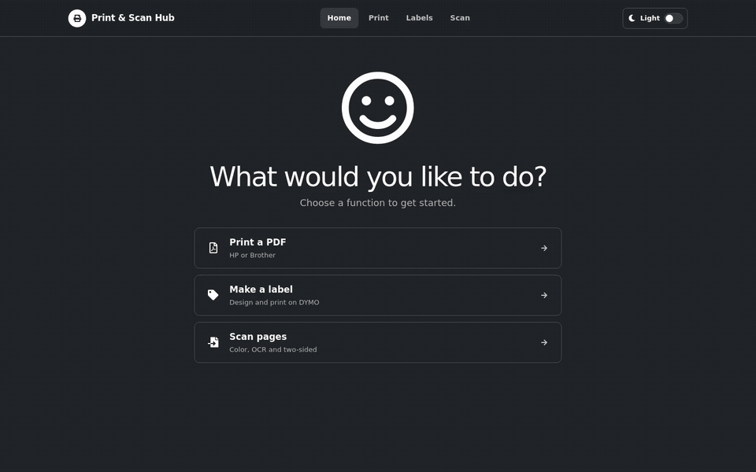
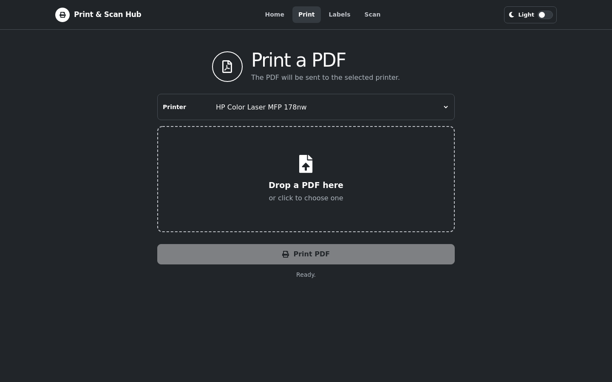
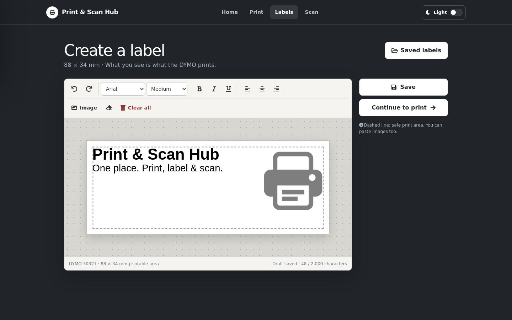
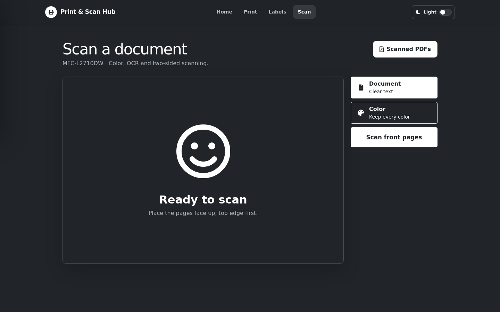
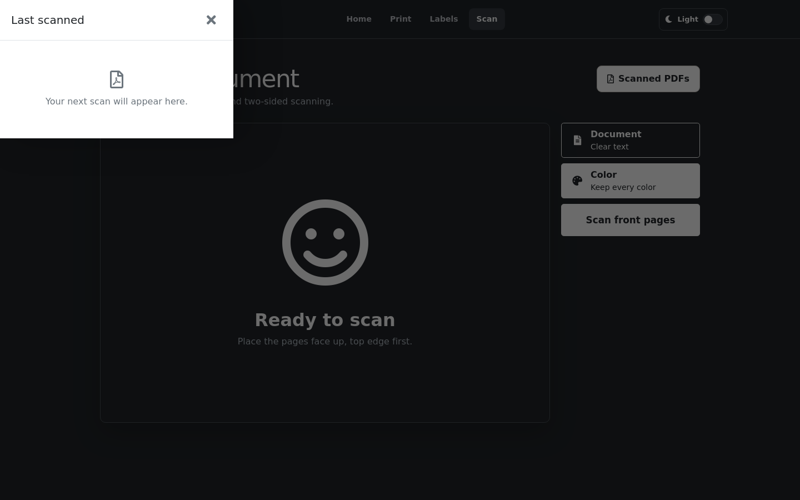

# Print & Scan Hub

Print & Scan Hub is a self-hosted, beginner-friendly web application for everyday printing, exact DYMO label design, and searchable document scanning. It combines the required drivers and services in Docker so that users only need a browser.

There are no user accounts, cloud uploads, or AI features. The application is intended for a trusted home, workshop, or small-office network.

## Credits and inspiration

Print & Scan Hub was strongly inspired by two open-source projects:

- [BrotherScannerDocker by Philipp Mundhenk](https://github.com/PhilippMundhenk/BrotherScannerDocker) provided the central ideas for browser-based Brother scanning, the guided front/back workflow, PDF management, and an approachable scanner interface.
- [Steam Deck Printing ROOTLESS by Tymose](https://github.com/Tymose/Steam-Deck-Printing-ROOTLESS) inspired the containerized CUPS setup and the PDF hotfolder workflow for straightforward document printing.

Many thanks to their authors and contributors for sharing their work. Print & Scan Hub brings these ideas together with its own unified interface, isolated OCR service, label editor, device configuration, and safety checks.

## See it in action

[](docs/media/walkthrough.mp4)

The preview shows the real application in an isolated English demo environment. Select it to open the [10-second MP4 walkthrough](docs/media/walkthrough.mp4).

| PDF printing | Exact label editor |
| --- | --- |
| [](docs/media/document-printing.png) | [](docs/media/label-editor.png) |

| Guided scanning | Scanned-PDF sidebar |
| --- | --- |
| [](docs/media/scanner.png) | [](docs/media/scanner-library.png) |

## Features

### Document printing

- Upload a PDF in the browser and choose a configured document printer.
- Print a stored scan directly from its sidebar entry, with a printer chooser before submission.
- Automatically print PDFs copied into the configurable hotfolder.
- Wait until a hotfolder file is unchanged and has a valid PDF header and end marker before printing it. This prevents incomplete network copies from being submitted.
- Keep rejected hotfolder jobs for an automatic retry instead of silently deleting them.
- Show understandable printer availability and job feedback in the interface.

### Label design and printing

- Design DYMO 30321 Large Address labels on an exact 88 x 34 mm WYSIWYG canvas.
- Print the rendered 300 dpi artwork at 1:1 scale on a DYMO LabelWriter 450.
- Choose from seven font families in a visual font-preview menu, including bundled open-source sans, condensed, serif, and monospaced DejaVu fonts, then apply font size, bold, italic, underline, and alignment controls.
- Add multiple text boxes, freely position and resize them in both directions, and continue editing and formatting their contents independently. Text boxes automatically grow when new lines are added.
- Undo, redo, clear, and preview edits.
- Paste or upload images, then freely position, resize, drag, or move them with the keyboard.
- Insert useful label symbols such as warning, fragile, this-side-up, keep-dry, recycling, phone, email, and package marks; symbols remain editable and proportionally resizable.
- Save labels, reopen and edit them later, create a copy, rename them, or delete them.
- Select the number of label copies before printing.
- Keep saved labels in the same sidebar-based workflow used for scanned documents.

### Scanning and OCR

- Scan one-sided pages from a Brother network automatic document feeder.
- Use a guided front/back workflow for two-sided originals on a simplex feeder.
- Choose document gray for clear, compact text scans or full color when colors matter.
- Capture at 150 dpi in True Gray or 24-bit color with the reference scanner.
- Remove blank pages and interleave front and back pages in the correct order.
- Create searchable PDFs with German and English OCR using OCRmyPDF and Tesseract.
- Run OCR in a separate, read-only container with no persistent temporary volume.
- Limit scanner and OCR scratch space with 2 GiB tmpfs mounts; temporary data disappears on restart.
- Download, rename, prefix, print, or delete completed scans in the browser.
- Retry failed OCR and retain the original assembled PDF for recovery.

### Interface and operation

- Use the interface in English or German through one deployment setting.
- Start in dark mode or switch to a browser-persisted light mode.
- Use a consistent, responsive interface on desktop, tablet, and mobile screens.
- Install the HTTPS site as a Progressive Web App (PWA).
- Serve interface assets locally, including Font Awesome icons; normal use does not depend on a public CDN.
- Run exactly four health-checked containers with bounded Docker logs and automatic restart after failures or host reboots.
- Expose only the web service to the host; CUPS, scanner, and OCR remain on the private Compose network.

## Platform support

The host does **not** need to run Debian. Any modern Linux distribution that supports Docker Engine and Docker Compose v2 can host the application. Debian Bookworm is used inside several container images and is independent of the host distribution.

The complete current stack requires an **x86_64/amd64 Linux host** because the included Brother `brscan4` scanner package is an amd64 binary. The CUPS image already handles amd64 and arm64 for the bundled HP driver, but the full application is not currently supported on arm64 until the Brother scanner backend is replaced or an appropriate redistributable arm64 driver is added.

Linux is the supported host platform because the deployment uses direct USB device access for the DYMO and Linux printer/scanner drivers. Docker Desktop on macOS or Windows is not a supported hardware deployment.

## Supported hardware

The repository ships with configuration and drivers for these reference devices:

| Device | Supported functions | Connection and driver | Status |
| --- | --- | --- | --- |
| Brother MFC-L2710DW | A4 document printing; network ADF scanning in gray or color | IPP printing with `brlaser`; network scanning with Brother `brscan4` | Verified reference device |
| HP Color Laser MFP 178nw | A4 color document printing | JetDirect/AppSocket with the pinned HP SPL-C ULD driver | Verified reference device |
| DYMO LabelWriter 450 | 30321 Large Address label printing | USB with `printer-driver-dymo` | Verified reference device |

The Brother printer example uses the `MFC-L2700DW` scanner model identifier because that is the compatible identifier expected by `brscan4` for the reference MFC-L2710DW.

Other document printers can often be added without changing application code when they support driverless IPP or a compatible CUPS driver already exists in the CUPS image. A device is not automatically supported merely because it uses USB or appears in CUPS: its driver, protocol, media options, architecture, and licensing must also be compatible.

The current scanner workflow is specifically implemented for Brother `brscan4`, and the label workflow is calibrated for the DYMO LabelWriter 450 with 30321 stock. Supporting another scanner family or label format normally requires a code contribution; see [Adding support for another device](#adding-support-for-another-device).

## Architecture

The deployment contains exactly four containers:

| Service | Responsibility |
| --- | --- |
| `web` | Shared interface, saved labels, PDF submission, hotfolder monitoring, and scan file management |
| `cups` | Document and label queues, printer drivers, and print spooling |
| `scanner` | Brother SANE driver, front/back scanning, blank-page filtering, and PDF assembly |
| `ocr` | Isolated OCRmyPDF and Tesseract processing in German and English |

Only `web` is published, on host port `8081` by default. Every service uses `restart: unless-stopped`: Docker restarts it after a process failure and after a host reboot, unless an administrator explicitly stopped the service.

Persistent application data is stored below `data/` by default. OCR scratch data is never persisted. Docker JSON logs rotate at 10 MiB with three files per container.

## Installation

### 1. Check the host

You need:

- an x86_64/amd64 Linux system with Docker Engine and the Docker Compose v2 plugin;
- Git;
- permission to run Docker commands;
- at least 3 GiB of available RAM for peak scanning and OCR work;
- network access from the host to the Brother and document printers;
- USB access to the DYMO when label printing is required; and
- a trusted local network, reverse-proxy authentication, or a VPN.

Confirm that Docker and Compose are available:

```console
docker --version
docker compose version
```

### 2. Clone the repository

```console
git clone https://github.com/vgarcia007/printer-gui.git
cd printer-gui
```

### 3. Create local configuration

Copy the public examples. The resulting files are ignored by Git, so real device addresses and secrets are not published accidentally.

```console
cp .env.example .env
cp config/printers.json config/printers.local.json
```

Generate a secret value:

```console
openssl rand -hex 32
```

Edit `.env` and replace `SECRET_KEY` with the generated value. At minimum, also set:

- `SCANNER_IP` to the Brother scanner's fixed address;
- `SCANNER_MODEL` to its `brscan4` model identifier (`MFC-L2700DW` for the reference MFC-L2710DW);
- `UI_LANGUAGE` to `en` or `de` (`en` is the default);
- `APP_UID` and `APP_GID` to the owner of stored labels and scans, normally the output of `id -u` and `id -g`; and
- `TZ` to the host's time zone.

The default host port is `8081`. Change `WEB_PORT` only if that port is already in use.

### 4. Configure printers

Edit `config/printers.local.json`. Replace the documentation-only IP addresses and URIs with the real devices on the local network. Do not edit or commit the public example with private addresses.

Each printer entry contains:

| Field | Meaning |
| --- | --- |
| `name` | Stable, CUPS-safe queue name used internally |
| `label` | Friendly name displayed to users |
| `kind` | `document` or `label` |
| `uri` | CUPS device URI, for example an IPP, socket, LPD, or USB URI |
| `driver` | Exact CUPS model identifier, or `everywhere` for a compatible driverless IPP printer |
| `options` | Queue defaults such as paper size, color model, or quality |

`defaultDocumentPrinter` selects the hotfolder and initial document printer. `labelPrinter` identifies the label queue.

After the stack is running, these commands show detected device URIs, installed model identifiers, and configured queues:

```console
docker compose exec cups lpinfo -v
docker compose exec cups lpinfo -m
docker compose exec cups lpstat -p -d
```

On every CUPS container start, the JSON configuration is reconciled with CUPS. Queues omitted from the file are removed, so `printers.local.json` is the source of truth rather than the CUPS web interface.

### 5. Validate and start

Check the resolved Compose configuration, build the images, and start the stack:

```console
docker compose config --quiet
docker compose up -d --build
docker compose ps
```

All four services should become healthy. Verify the web and scanner APIs without causing a physical print or scan:

```console
curl --fail http://localhost:8081/health
curl --fail http://localhost:8081/scans/api/status
```

If a service is not healthy, inspect it with:

```console
docker compose logs --tail=200 SERVICE_NAME
```

### 6. Open the interface

Open `http://SERVER-IP:8081` in a browser. No sign-in is required.

For an installable PWA, put the application behind HTTPS. The anonymized [Apache reverse-proxy example](deploy/apache-vhost.example.conf) and step-by-step instructions in [Deployment](docs/deployment.md) contain no private hostname or certificate data. PWA printing and scanning still require a live connection to the server.

## Configuration notes

### Automatic PDF hotfolder

`data/jobs`, or the directory selected by `JOBS_HOST_DIR`, is watched automatically when `HOTFOLDER_ENABLED=true`. A complete PDF is sent to `defaultDocumentPrinter` after it remains unchanged for `HOTFOLDER_STABLE_SECONDS` (15 seconds by default). Incomplete files and jobs rejected by CUPS stay in the directory and are retried.

This host directory may be shared over a trusted network. Copy files into it; do not use it for permanent document storage because successfully submitted PDFs are removed.

### Scan storage and OCR

Final scans are stored in `data/scans` or `SCANS_HOST_DIR`. Mount a NAS path there if required, and ensure `APP_UID` and `APP_GID` can write to it.

Tesseract is not installed in the web or scanner service. OCRmyPDF and Tesseract run only in the separate `ocr` container. Its `/work` directory is a size-limited tmpfs, every request receives a temporary working directory, and cleanup runs after success or failure. Only the finished PDF or a recoverable original is written to persistent scan storage.

### DYMO dimensions and calibration

The DYMO 30321 roll is nominally 89 x 36 mm. The editor uses the driver's 88 x 34 mm printable area and displays a dashed 2 mm safe inset. The default calibration values keep artwork at 1:1 scale. Change the `DYMO_LANDSCAPE_*` values only after a measured test print; correction values intentionally make output differ from the editor.

### Saved data and updates

Back up `data/labels`, `data/scans`, and the configured CUPS data before major upgrades. Update an installation with:

```console
git pull --ff-only
docker compose up -d --build
make validate
```

## Everyday scanning

Place pages in the Brother feeder **face up, top edge first**. Select **Document** for clear text and smaller files or **Color** to preserve colors.

For a two-sided original, scan the front sides first. When prompted, keep the pages in the same order, turn the complete stack over, place it face up and top edge first, and select **Scan back sides**. OCR starts after all pages have been assembled.

## Adding support for another device

Contributions for additional hardware are welcome. Begin with an issue that names the exact model, host architecture, connection protocol, and available open-source or redistributable driver. Never add private addresses, credentials, scanned documents, or driver packages that the project is not licensed to redistribute.

### Document printers

For a driverless IPP printer or a model already supported by an installed driver:

1. Find its URI and model identifier with `lpinfo -v` and `lpinfo -m` inside the CUPS container.
2. Add it to the ignored `config/printers.local.json`; use `kind: "document"`.
3. Recreate the CUPS service and confirm the queue with `lpstat -p -d`.
4. Test status reporting, browser PDF printing, paper size, color/grayscale behavior, and the hotfolder.

If a driver is missing, add its installation to `cups/Dockerfile`. Pin downloads to a version and checksum, document the license and supported architectures, and update the public example only with documentation-range addresses. Prefer driverless IPP and distribution packages over proprietary installers.

### Scanners

A new scanner family requires a backend implementation, not only a printer JSON entry. Keep the existing scanner API and user-facing states so the web interface remains consistent. A contribution should provide:

- reliable device discovery and startup configuration;
- front-only and guided front/back ADF scanning;
- document gray and full-color modes;
- deterministic page order and blank-page handling;
- the existing separate OCR handoff and recovery behavior;
- bounded, non-persistent scratch space; and
- architecture and license checks for every bundled driver.

Open-source SANE backends are preferred. Proprietary packages may only be downloaded or redistributed when their license permits it.

### Label printers and media

The editor and renderer currently encode the DYMO 30321 printable area, orientation, and 300 dpi output. Another label printer or stock size needs:

- a redistributable CUPS driver in the `cups` image;
- a configurable queue and media option;
- an exact editor canvas and raster size derived from the driver's printable area;
- correct image, rich-text, and orientation rendering; and
- measured test prints that confirm position and 1:1 scale.

### Contribution checklist

1. Fork the repository and create a focused branch.
2. Keep source-language interface text, comments, tests, and documentation in English. Add translated UI strings to the locale catalog where applicable.
3. Add or update automated tests without triggering real hardware.
4. Run `make validate`.
5. Update this README and the relevant files below `docs/`.
6. Open a pull request describing the device, driver source and license, architectures, test setup, and any remaining limitations.

See [CONTRIBUTING.md](CONTRIBUTING.md) for the project-wide rules.

## Security

Anyone who can reach the web port can print, start scans, rename or delete scans, and manage saved labels. Do not expose port `8081` directly to the public internet. Limit access to a trusted LAN or add authentication or a VPN at the reverse proxy. See [SECURITY.md](SECURITY.md).

## Documentation

- [Deployment](docs/deployment.md)
- [Configuration](docs/configuration.md)
- [Architecture](docs/architecture.md)
- [Troubleshooting](docs/troubleshooting.md)
- [Development](docs/development.md)
- [Third-party software](THIRD_PARTY.md)

## License

Print & Scan Hub is licensed under the [GNU General Public License v3](LICENSE).
